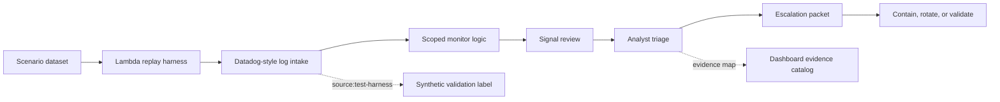
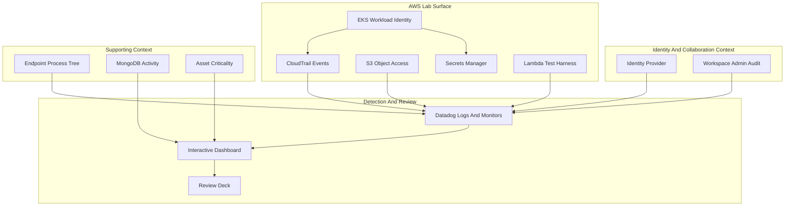
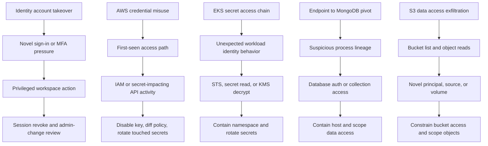
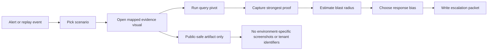
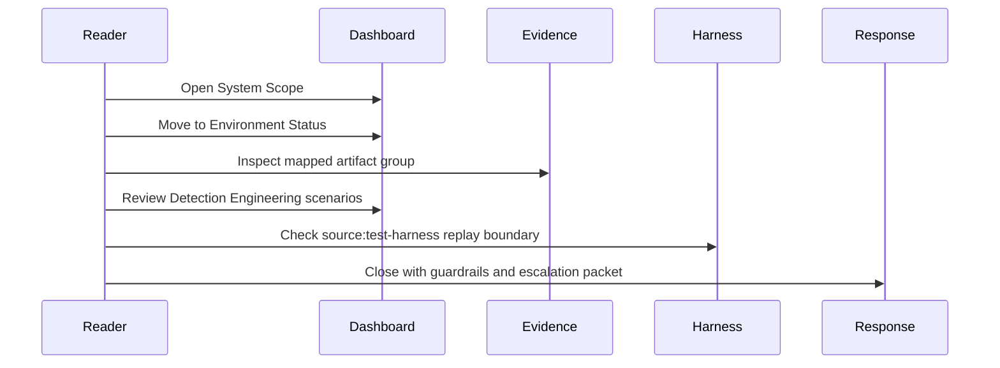

# Architecture And Flowcharts

This document is the public-safe visual map for the CloudSec SOC Detection Lab. It keeps the working detection model intact while removing private company names, tenant details, account identifiers, screenshots, credentials, and secret values.

## End-To-End Detection Flow

## Public-Safe Lab Architecture

## Scenario Correlation Model

## Evidence Handling Flow

## Technical Review Sequence

## Analyst Decision Gates

| Gate | Question | Public Lab Output |
|---|---|---|
| Entity | Which user, role, host, workload, or service account is in scope? | Scenario row plus evidence visual |
| Novelty | Is the source, device, API path, process, or time window unusual? | Query pivot and timeline context |
| Materiality | Did the activity touch privilege, secrets, protected data, or critical assets? | Asset criticality and proof map |
| Action | Should the analyst contain, validate, rotate, or escalate? | Checklist and escalation packet |
| Closure | Can another analyst continue from the packet? | Timeline, owner, next proof target |

## Sanitization Standard

- Use placeholder actors such as `admin.user`, `app-runtime-sa`, and `analyst.user`.
- Use placeholder cloud account IDs such as `EXAMPLE_ACCOUNT`.
- Use placeholder resource names such as `critical-service/db`, `records-mongo-lab`, and `sensitive-reporting-bucket`.
- Do not include private company names, tenant-specific screenshots, real credentials, secret values, private user data, or internal prep notes.
- Keep synthetic replay labeled with `source:test-harness` and `synthetic:true`.
